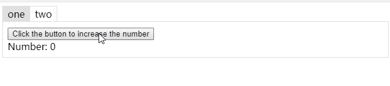

# Online Editor

- Basic([original](https://codesandbox.io/s/6wy4mlkkzn) | [currently](https://codesandbox.io/s/z657w5l4zl))

  

    
    
  

- [With React Router](https://codesandbox.io/s/yjn7k230z)
- [With React Loadable](https://codesandbox.io/s/3r5331vjl1)
- [Lifecycle and events](https://codesandbox.io/s/q1xprn1qq)
- [Control cache](https://codesandbox.io/s/llp50vxnq7)
- [Using animation](https://codesandbox.io/s/zljyprv8op)
- [useKeepAliveEffect](https://codesandbox.io/s/yp6qjk1vw1)
